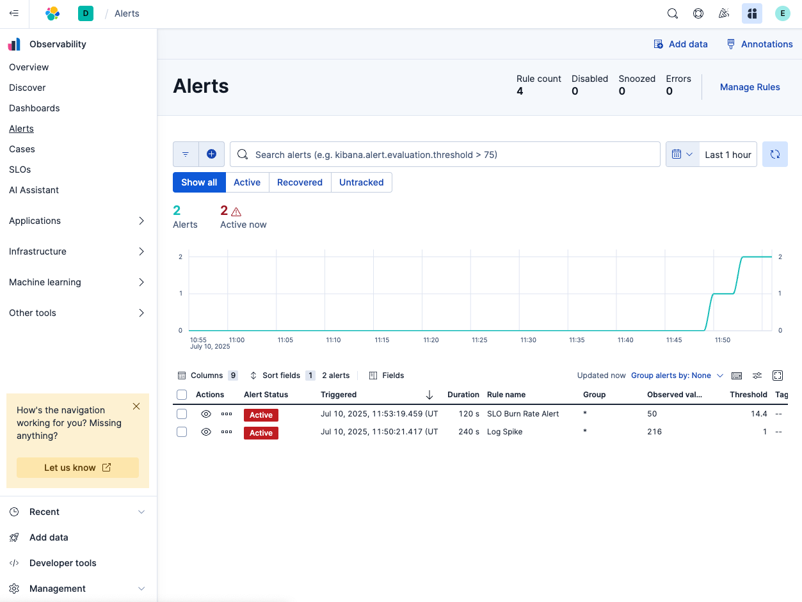

Now everything being green in our environment is great but we want to have a little more fun. Lets bring down the database.

Firstly head over to the SSH tab and enter the following commands.

```text
cd instruqt-scripts-v2/
./trigger-database-outage.sh
```
Make sure the time range is set to the last hour and head over to the business health dashboard.

Notice on the business health dashboard we start top see errors in our MySQL logs immediately:


Over time you can see on the dashboard our Database SLO starts to degrade.

Heading over to Alerts - we have two alerts that have popped up. The first alert is about the Database SLO is burning down rapidly and the second alert is about the spike in error logs.

